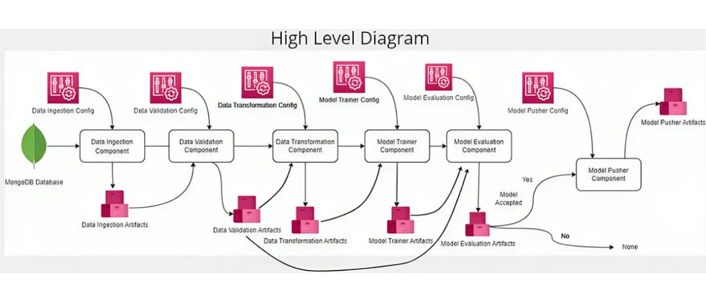

# 🛡️ Network Security: Phishing Detection ML Pipeline (End-to-End)

## 📚 Overview
This repository implements an **End-to-End Machine Learning Pipeline for Phishing Website Detection** using a modular, configurable, and production-ready approach.  
It automates the entire ML lifecycle starting from **Data Ingestion (MongoDB)** to **Model Deployment (API/UI)**.

The pipeline is structured into components:
1. Data Ingestion → 2. Data Validation → 3. Data Transformation → 4. Model Training → 5. Model Evaluation → 6. Model Deployment (Pusher & API)

## 🚀 Key Features
- Data Ingestion directly from **MongoDB Database**
- Data Validation with **Schema Enforcement**
- Feature Engineering and Data Transformation
- Automated **Model Training & Hyperparameter Tuning**
- **Experiment Tracking** with MLflow (DagsHub Integrated)
- Artifact-driven modular design for each pipeline step
- FastAPI-based Web Application for real-time inference
- Dockerized Deployment

## 📊 Dataset Schema
| Independent Features |
|----------------------|
| having_IP_Address, URL_Length, Shortining_Service, having_At_Symbol, double_slash_redirecting, Prefix_Suffix, |
| having_Sub_Domain, SSLfinal_State, Domain_registeration_length, Favicon, port, HTTPS_token, Request_URL, |
| URL_of_Anchor, Links_in_tags, SFH, Submitting_to_email, Abnormal_URL, Redirect, on_mouseover, RightClick, |
| popUpWidnow, Iframe, age_of_domain, DNSRecord, web_traffic, Page_Rank, Google_Index, Links_pointing_to_page, |
| Statistical_report |

| Dependent Feature (Target) | Description |
|----------------------------|-------------|
| Result                     | (1 = Phishing, -1 = Legit) |

## 🗂️ Project Directory Structure
```
.
├── networksecurity/                  # Core pipeline modules (components, configs, entities, utils)
│   ├── components/                   # DataIngestion, Validation, Transformation, Trainer, Evaluator, Pusher
│   ├── config/                       # Configuration classes for pipeline components
│   ├── entity/                       # Data classes for artifacts and configs
│   ├── utils/                        # Utility modules (IO, Metrics, Estimators)
│   └── exception/                    # Custom exception handling
│
├── data_schema/                      # JSON schema for data validation
├── Network_Data/                     # Local raw dataset (for reference)
├── valid_data/                       # Validated datasets
├── final_model/                      # Final trained model artifacts (model.pkl)
├── prediction_output/                # Inference results from batch predictions
├── templates/                        # Jinja2 HTML templates for the UI
├── app.py                            # FastAPI Web App for inference
├── main.py                           # Orchestration script to trigger full pipeline
├── push_data.py                      # Script to push data to MongoDB
├── test_mongodb.py                   # Test script for MongoDB connectivity
├── Dockerfile                        # Docker image specification
├── requirements.txt                  # Python dependencies
└── setup.py                          # Package configuration
```

## 🛠️ End-to-End Workflow Architecture

### High-Level Pipeline Flow:


1. **Data Ingestion** → Pull data from **MongoDB**
2. **Data Validation** → Validate structure against **data_schema/**
3. **Data Transformation** → Feature engineering, encoding, scaling
4. **Model Training** → Train & evaluate models (Random Forest, XGBoost, etc.)
5. **Model Evaluation** → Compare with baseline, decide deployment readiness
6. **Model Pusher** → Save accepted model to **final_model/** for deployment
7. **Web App/API** → Serve live predictions through **app.py**

## 🖥️ How to Run the Project Locally


### Data Ingestion to MongoDB
```bash
python push_data.py
```

### Run End-to-End ML Pipeline
```bash
python main.py
```

### Launch Web Application
```bash
python app.py
```
Visit: `http://127.0.0.1:8000/` to access the Phishing Prediction UI.

## 🧠 Model Training & Experiment Tracking
- Models Trained: Random Forest, Decision Tree, Gradient Boosting, Logistic Regression, AdaBoost
- Automated Hyperparameter Tuning
- Experiment Tracking:
  - MLflow is integrated with **DagsHub** for metrics & artifact logging.
  - Metrics Logged: Precision, Recall, F1-score (Train/Test)
  - Artifacts: Model files, logs

## 📦 Artifacts Produced
| Artifact Name                  | Description                                     |
|-------------------------------|-------------------------------------------------|
| Data Ingestion Artifacts        | Raw data pulled from MongoDB                   |
| Data Validation Artifacts       | Schema-validated, clean dataset                |
| Data Transformation Artifacts   | Preprocessed feature vectors                   |
| Model Trainer Artifacts         | Trained model with evaluation metrics          |
| Model Pusher Artifacts          | Deployment-ready model (model.pkl)             |
| prediction_output/              | Inference results for sample test cases        |

## 🛠️ Technologies & Tools
- Python 3.8+
- FastAPI / Flask (Web App)
- MongoDB Atlas
- scikit-learn
- MLflow + DagsHub
- Docker (Optional for deployment)

## 🧑‍💻 Author
- **Nagendra K P** | [GitHub](https://github.com/nagendrakp02)
